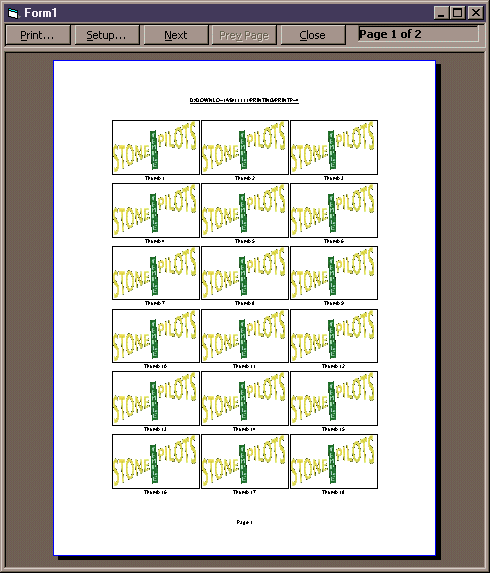



## How to Add Print Preview to VB \(Part II\)

### Description

I started this project nearly a year ago to provide printing and print-previewing in my applications. This project has a lot of room for improvement, so my hope is that you can take this project and run with it for I have limited time to develop it any further.

The project has two dependencies: SSubtmr.dll and Win.tlb (large file). When you un-zip the file, please pay close attention to these dependencies in order to make the project work. Credit goes to Steve McMahon and Bruce McKinney for these libraries.

Get them here:

http://vbaccelerator.com/codelib/ssubtmr/ssubtmr.zip

http://www.twocyclones.com/Files/Win.zip
 
### More Info
 

             |
---                |---
**Submitted On**   |2000-12-30 21:29:28
**By**             |[Vincent Lozada](https://github.com/Planet-Source-Code/PSCIndex/blob/master/ByAuthor/vincent-lozada.md)
**Level**          |Advanced
**User Rating**    |4.8 (38 globes from 8 users)
**Compatibility**  |VB 6\.0
**Category**       |[Custom Controls/ Forms/  Menus](https://github.com/Planet-Source-Code/PSCIndex/blob/master/ByCategory/custom-controls-forms-menus__1-4.md)
**World**          |[Visual Basic](https://github.com/Planet-Source-Code/PSCIndex/blob/master/ByWorld/visual-basic.md)
**Archive File**   |[CODE\_UPLOAD13271112001\.zip](https://github.com/Planet-Source-Code/vincent-lozada-how-to-add-print-preview-to-vb-part-ii__1-14029/archive/master.zip)

